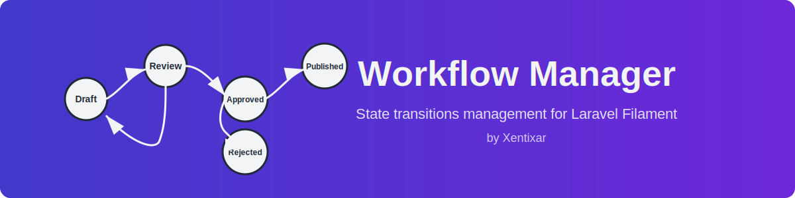

# Workflow Manager for Laravel Filament



A powerful workflow management package for Laravel Filament that allows you to define and manage state transitions for your Laravel models using PHP enums.

## Overview

Workflow Manager provides a simple yet flexible way to define and manage workflows in your Laravel Filament application. It allows you to:

- Define workflow states for your models using PHP enums
- Configure transitions between states with validation
- Visualize workflows with interactive Mermaid.js diagrams
- Control access to state transitions based on user roles
- Add workflow management to any Laravel model
- Support for role-based workflow management
- Include parent state transitions (configurable reverse transitions)
- Flexible action-based validation with ignored actions
- Type-safe state management with PHP 8.1+ enum integration

## Features

✨ **PHP Enum Integration** - Leverage PHP 8.1+ enums for type-safe state management

🎨 **Interactive Diagrams** - Visualize workflows with auto-generated Mermaid.js flowcharts showing forward and reverse transitions

👥 **Role-Based Workflows** - Create different workflow rules for different user roles (admin, user, etc.)

🔒 **Laravel Authorization** - Built-in policy support using Laravel's native authorization system

⚡ **Flexible Validation** - Configure actions where workflow validation should be bypassed (create, replicate, etc.)

🔄 **Bidirectional Transitions** - Enable reverse transitions to allow going back to previous states

🎯 **Form Component** - Ready-to-use `StateSelect` component with automatic validation

🔍 **Auto Discovery** - Automatically detects models implementing the workflow contract

⚙️ **Highly Configurable** - Customize navigation, permissions, roles, and behavior via config file

## Requirements

- PHP 8.1 or higher
- Laravel 11.0 or higher
- Filament 4.0 or higher

## Installation

You can install the package via composer:

```bash
composer require xentixar/workflow-manager
```

After installing the package, you can publish the assets separately:

```bash
# Publish configuration (includes navigation and permission settings)
php artisan vendor:publish --tag=workflow-manager-config

# Publish migrations
php artisan vendor:publish --tag=workflow-manager-migrations
```

> **Note**: Starting from v2.0, translations have been moved to the configuration file for easier management. You no longer need to publish separate translation files.

Then run the migrations:

```bash
php artisan migrate
```

## Configuration

After publishing the configuration file, you can find it at `config/workflow-manager.php`. Here are the available configuration options:

### Roles

Define the roles that will be used to bind workflows to users:

```php
'roles' => [
    'admin' => 'Admin',
    'user' => 'User',
    // Add your custom roles here
],
```

### Include Parent

Determine whether parent states should be included with child states in select options. When enabled, users can transition back to previous states:

```php
'include_parent' => true,
```

### Enable Policy

Enable or disable the workflow policy. When enabled, it uses Laravel's built-in authorization system:

```php
'enable_policy' => true,
```

### Ignored Actions

Specify which Filament actions should ignore workflow validation. During these actions, all state options will be available:

```php
'ignored_actions' => [
    'create',
],
```

### Navigation

Customize how the Workflow Manager appears in the Filament navigation:

```php
'navigation' => [
    'label' => 'State Workflows',
    'group' => 'Settings',
    'sort' => "1",
    'icon' => 'heroicon-o-arrows-right-left',
    'slug' => 'workflows',
],
```

### Permissions

Define the permission names used for authorization when policies are enabled:

```php
'permissions' => [
    'view_any' => 'view_any_workflow',
    'view' => 'view_workflow',
    'create' => 'create_workflow',
    'update' => 'update_workflow',
    'delete' => 'delete_workflow',
    'restore' => 'restore_workflow',
    'force_delete' => 'force_delete_workflow',
    'reorder' => 'reorder_workflow',
    'replicate' => 'replicate_workflow',
],
```

## Configuration Customization

All customization options are now consolidated in the configuration file for easier management. After publishing the configuration file, you can modify:

## Usage

### Setting Up Your Models

To use Workflow Manager with your models, implement the `WorkflowsContract` interface and use the `HasWorkflows` trait:

```php
<?php

namespace App\Models;

use Illuminate\Database\Eloquent\Model;
use Xentixar\WorkflowManager\Contracts\WorkflowsContract;
use Xentixar\WorkflowManager\Traits\HasWorkflows;

class YourModel extends Model implements WorkflowsContract
{
    use HasWorkflows;

    /**
     * Get the enum class representing available states.
     *
     * @return string
     */
    public static function getStates(): string
    {
        return YourModelStatusEnum::class;
    }
}
```

### Creating State Enums

Create a PHP enum that defines your workflow states:

```php
<?php

namespace App\Enums;

enum YourModelStatusEnum: string
{
    case DRAFT = 'draft';
    case REVIEW = 'review';
    case APPROVED = 'approved';
    case PUBLISHED = 'published';
    case REJECTED = 'rejected';

    public function getLabel(): string
    {
        return match ($this) {
            self::DRAFT => 'Draft',
            self::REVIEW => 'Under Review',
            self::APPROVED => 'Approved',
            self::PUBLISHED => 'Published',
            self::REJECTED => 'Rejected',
        };
    }
}
```

The `getStates()` method should return the fully qualified class name of your enum. The enum must be a backed enum with string values and should include a `getLabel()` method for human-readable labels.

### Registering the Plugin with Filament

Register the Workflow Manager plugin in your Filament panel provider:

```php
use Xentixar\WorkflowManager\WorkflowManager;

public function panel(Panel $panel): Panel
{
    return $panel
        // ...other configuration
        ->plugins([
            WorkflowManager::make(),
        ]);
}
```

### Creating Workflows

Once the package is installed and configured, you can create and manage workflows through the Filament admin panel. Navigate to the "Workflows" section in your Filament admin panel to:

1. Create a new workflow by selecting the target model
2. Define the workflow name
3. Assign a role that can manage this workflow
4. Set up transitions between states

### Workflow State Selection in Forms

You can use the `StateSelect` component in your Filament forms:

```php
use Xentixar\WorkflowManager\Forms\Components\StateSelect;

StateSelect::make('status')
    ->setWorkflowForModel(YourModel::class)
    ->setRole('admin')
    ->required()
```

The component requires two method calls:
1. `setWorkflowForModel()` - The model class that implements the `WorkflowsContract` interface
2. `setRole()` - The role that should manage this workflow (must match a key in the roles configuration)

This will automatically display the appropriate state options based on the defined workflow and the current state of the model, enforcing workflow transition rules.

#### Ignoring Workflow Validation on Specific Actions

You can configure specific actions where workflow validation should be ignored, allowing all state options to be available:

```php
StateSelect::make('status')
    ->setWorkflowForModel(YourModel::class)
    ->setRole('admin')
    ->setIgnoredActions(['create', 'replicate'])
    ->required()
```

The `setIgnoredActions()` method accepts:
- An array of action names to ignore (e.g., `'create'`, `'edit'`, `'replicate'`)
- An optional second parameter `$override` (default: `false`) - if `true`, replaces the default ignored actions; if `false`, merges with the default list from configuration

By default, the component uses the `ignored_actions` configuration from `config/workflow-manager.php`.

### Transition Rules

When defining state transitions in the admin panel, you can specify:

1. **From State**: The starting state for the transition (parent state)
2. **To State**: The destination state for the transition (child state)
3. **Workflow Context**: Each transition belongs to a specific workflow and role

The package automatically validates transitions based on your defined rules:
- Users can only transition to states that have been explicitly defined as valid transitions
- If `include_parent` is enabled in configuration, users can also transition back to previous states (reverse transitions)
- During ignored actions (like 'create' by default), all states are available regardless of workflow rules
- You can customize ignored actions per form using `setIgnoredActions()` method

## Visualizing Workflows

The Workflow Manager includes an admin interface through Filament where you can:

- View all defined workflows
- Create new workflows for your models
- Manage states for each workflow
- Define transitions between states
- Visualize the workflow structure with interactive diagrams

The admin interface automatically detects models that implement the `WorkflowsContract` interface and makes them available for workflow creation.

### Interactive Workflow Diagrams

Workflow Manager includes built-in visualization of your workflows using Mermaid.js diagrams. Each workflow displays an interactive flowchart showing:

- **States**: All defined states in your workflow
- **Forward Transitions**: Solid arrows (`-->`) showing allowed state transitions
- **Reverse Transitions**: Dotted arrows (`-.->`) showing backward transitions (when `include_parent` is enabled)
- **Start Node**: Visual indicator of workflow entry points

The diagrams are automatically generated based on your workflow configuration and update dynamically as you modify transitions. This provides a clear visual representation of your workflow logic, making it easier to understand and maintain complex state machines.

## Advanced Usage

### Custom Validation Rules

The `StateSelect` component automatically applies validation rules based on your workflow configuration. It uses Laravel's `Rule::in()` to ensure only valid transitions are allowed.

### Customizing Ignored Actions

You can control workflow validation behavior for specific actions:

**Global Configuration** (applies to all StateSelect components):
```php
// config/workflow-manager.php
'ignored_actions' => [
    'create',
    'replicate',
],
```

**Per-Component Configuration**:
```php
// Merge with global ignored actions (default behavior)
StateSelect::make('status')
    ->setWorkflowForModel(YourModel::class)
    ->setRole('admin')
    ->setIgnoredActions(['edit']) // Adds 'edit' to the list
    ->required()

// Override global ignored actions completely
StateSelect::make('status')
    ->setWorkflowForModel(YourModel::class)
    ->setRole('admin')
    ->setIgnoredActions(['create', 'replicate'], override: true) // Replaces the list
    ->required()
```

### Role-based Workflow Management

Different roles can have different workflows for the same model. For example:
- Admins might have access to all state transitions
- Regular users might have limited transition options
- Managers might have their own workflow with different rules

### Automatic Model Discovery

The package includes a `Helper` class that automatically discovers models in your application that implement the `WorkflowsContract` interface, making them available in the admin panel.

### Enum Integration

The package is designed to work seamlessly with PHP enums, providing type safety and better code organization compared to string-based states.

### Workflow Visualization

The package includes a powerful visualization component that renders your workflows as interactive diagrams:

**Diagram Features:**
- **Automatic Generation**: Diagrams are generated automatically from your workflow configuration
- **Visual State Representation**: Each state is displayed as a node with its label
- **Transition Arrows**: Solid arrows show forward transitions, dotted arrows show reverse transitions
- **Real-time Updates**: Diagrams update immediately when you modify workflow transitions
- **Mermaid.js Integration**: Uses Mermaid.js for clean, professional diagram rendering

The diagram clearly shows:
```
Draft --> Under Review --> Approved --> Published
  ^          ^              ^
  |          |              |
  '----------'--------------' (if include_parent is enabled)
```

### Integrating with Permissions

When `enable_policy` is set to `true`, the package will use Laravel's built-in authorization system to control access to workflows. You can implement permissions using Laravel Gates, Policies, or any authorization package like Spatie's Laravel Permission. The policy checks for permissions using Laravel's standard `$user->can()` method.

## Examples

### A Simple Approval Workflow

```php
// Enum definition
<?php

namespace App\Enums;

enum DocumentStatusEnum: string
{
    case DRAFT = 'draft';
    case SUBMITTED = 'submitted';
    case APPROVED = 'approved';
    case REJECTED = 'rejected';

    public function getLabel(): string
    {
        return match ($this) {
            self::DRAFT => 'Draft',
            self::SUBMITTED => 'Submitted',
            self::APPROVED => 'Approved',
            self::REJECTED => 'Rejected',
        };
    }
}

// Model definition
class Document extends Model implements WorkflowsContract
{
    use HasWorkflows;

    protected $fillable = ['title', 'content', 'status'];

    protected function casts(): array
    {
        return [
            'status' => DocumentStatusEnum::class,
        ];
    }

    public static function getStates(): string
    {
        return DocumentStatusEnum::class;
    }
}

// In your Filament resource
use Xentixar\WorkflowManager\Forms\Components\StateSelect;

// Form definition
public static function form(Form $form): Form
{
    return $form
        ->schema([
            TextInput::make('title')->required(),
            Textarea::make('content')->required(),
            StateSelect::make('status')
                ->setWorkflowForModel(Document::class)
                ->setRole('admin')
                ->setIgnoredActions(['create']) // Optional: customize ignored actions
                ->required(),
        ]);
}
```

## Troubleshooting

### Common Issues

1. **Workflows not appearing**: Make sure your model correctly implements the `WorkflowsContract` interface and uses the `HasWorkflows` trait.
2. **Cannot access workflow management**: Check that the user has the appropriate permissions if you have enabled policies.
3. **State options not showing**: Verify that you have defined states in your model's `getStates()` method and that it returns a valid enum class name.
4. **Enum not found**: Ensure your enum class exists and is properly namespaced. The `getStates()` method should return the fully qualified class name.
5. **Invalid transitions**: Check that you have defined the appropriate transitions in the workflow admin interface.
6. **Component not found**: Make sure you're importing `StateSelect` from the correct namespace: `Xentixar\WorkflowManager\Forms\Components\StateSelect`.
7. **All states available during edit**: This is expected behavior if 'edit' is not in your `ignored_actions` configuration. Add it if you want workflow validation during edits.
8. **Diagram not rendering**: Ensure Mermaid.js is properly loaded. The package includes it automatically in the Filament admin panel.
9. **Reverse transitions not showing**: Check that `include_parent` is set to `true` in your `config/workflow-manager.php` file.
10. **Workflow validation bypassed**: Verify that the current action is not in the `ignored_actions` list, either globally or per-component.

## Contributing

Contributions are welcome! Please feel free to submit a Pull Request.

## License

This package is open-sourced software licensed under the MIT license.

## Credits

- Developed by [Xentixar](mailto:xentixar@gmail.com).
- Built for Laravel Filament framework.